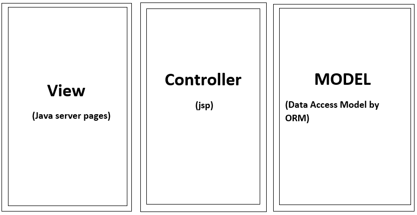

# Javaproject
Objective:
A software product which provides solution for baby health, baby food, baby tips, baby products, baby names, parenting etc. Here, user can view baby names, baby tips, baby food and baby product.

Users of the System
 Users:
1.	Can view baby names.
2.	Can view baby tips.
3.	Can view baby food.
4.	Can view baby products.

Tools to be used
1.	Use an IDE to develop the project which is- Eclipse / Netbeanse.
2.	MySql for the database.
3.	Server: Apache Tomcat.

How It Works:
1.	Create account with signing up, so by this your details were filled in database.
2.	Login with valid user id and password, so by this your valid username and password retrieve from database for verification.
3.	Now home page will appear with tips of baby health, baby food, baby tips, baby products, baby names, parenting etc. Here, user can view baby names, baby tips, baby food and baby product.
4.sinse i have used session management so without following the first two steps, you cannot reach the home page.

Technology used:
MVC Architecture with ORM architecture.

MVC:

The Model-View-Controller (MVC) framework is an architectural pattern that separates an application into three main logical components Model, View, and Controller. Hence the abbreviation MVC. Each architecture component is built to handle specific development aspect of an application. MVC separates the business logic and presentation layer from each other. It was traditionally used for desktop graphical user interfaces (GUIs). Nowadays, MVC architecture has become popular for designing web applications as well as mobile apps.

ORM:

Object-relational mapping (ORM, O/RM, and O/R mapping tool) in computer science is a programming technique for converting data between incompatible type systems using object-oriented programming languages. This creates, in effect, a "virtual object database" that can be used from within the programming language. There are both free and commercial packages available that perform object-relational mapping, although some programmers opt to construct their own ORM tools.
In object-oriented programming, data-management tasks act on objects that are almost always non-scalar values. For example, an address book entry that represents a single person along with zero or more phone numbers and zero or more addresses. This could be modeled in an object-oriented implementation by a "Person object" with attributes/fields to hold each data item that the entry comprises: the person's name, a list of phone numbers, and a list of addresses. The list of phone numbers would itself contain "PhoneNumber objects" and so on. 

CLASS DIAGRAM:

Class diagram is a static diagram. It represents the static view of an application. Class diagram is not only used for visualizing, describing, and documenting different aspects of a system but also for constructing executable code of the software application.
Class diagram describes the attributes and operations of a class and also the constraints imposed on the system. The class diagrams are widely used in the modeling of objectoriented systems because they are the only UML diagrams, which can be mapped directly with object-oriented languages.
Class diagram shows a collection of classes, interfaces, associations, collaborations, and constraints. It is also known as a structural diagram.
